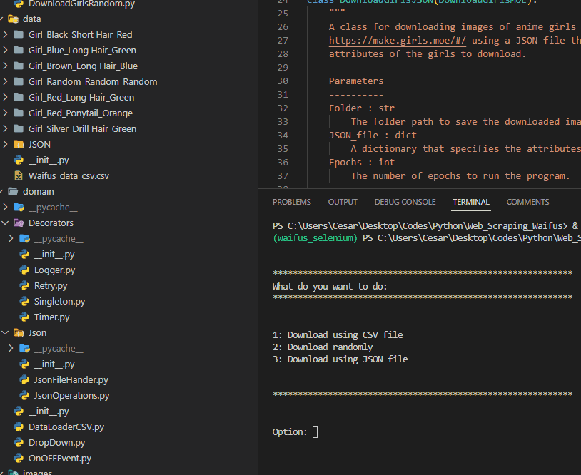
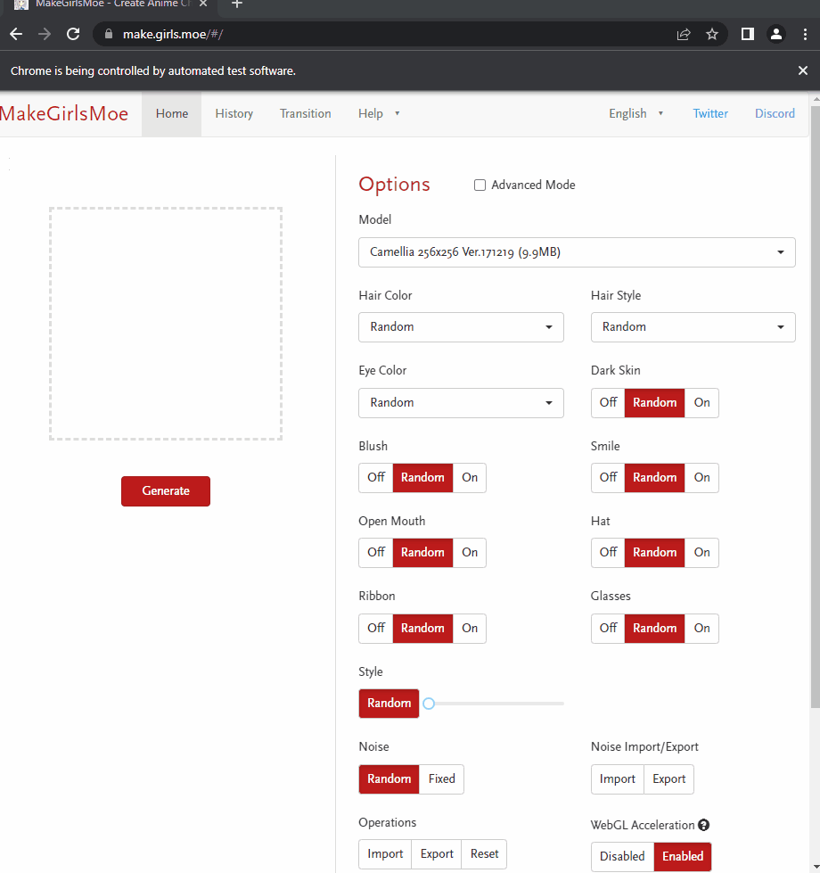

<a name="readme-top"></a>

# Download image from https://make.girls.moe/#/

"make.girls.moe" is a website that uses artificial intelligence to generate anime-style characters. It utilizes a generative adversarial network (GAN) to generate images of characters based on random input. The website allows you to choose various attributes of the generated character, such as hair style, eye color, clothing, and more.

The purpose of the website is to provide a fun and accessible tool for generating anime-style characters for use in various projects, such as creating digital artwork or designing characters for games. The generated characters can be used for personal or commercial purposes. Using the website is simple and straightforward. You can select the various attributes of the character you want to generate, and the website will display the resulting image. You can then download the image in PNG format or share it on social media.


## Setup

To create a virtual environment with using Anaconda, follow these steps:

Clone github repository in your local system.

```python
git clone https://github.com/DreamnovaCesar/Selenium_MOE_GAN_downloader.git
```

Move in Selenium_MOE_GAN_downloader repository

```python
cd Selenium_MOE_GAN_downloader
```

Open the Anaconda Prompt by clicking the Start button and typing "Anaconda Prompt".
Type the following command to create a new virtual environment called "tfenv":

```python
conda create --name tfenv
```

Activate the virtual environment by typing:

```python
conda activate tfenv
```

Finally, install requirements.txt.

```python
conda install requirements.txt
```

when creating the virtual environment, as this algorithm does not plan to be a library at the moment. You will have to use the following CLI code for activation:

```python
python -m app.src.main
```

### Visual instance

This gif shows the menu and the selection of the option using a CSV file.



An example of the software's behavior.



### Built With

&nbsp;
&nbsp;

## Contributing

Pull requests are welcome. For major changes, please open an issue first
to discuss what you would like to change.

Please make sure to update tests as appropriate.

### 🤝🏻 Connect with Me

<p align="center">
<a href="https://www.linkedin.com/in/cesar-eduardo-mu%C3%B1oz-chavez-a00674186/"></a>
<a href="https://twitter.com/CesarEd43166481"></a>
<a href="https://www.facebook.com/cesareduardo.munozchavez/"></a>
<a href="mailto:cesareduardomucha@hotmail.com"></a>
<a href="mailto:cesareduardomucha@gmail.com"></a>
</p>

<p align="right">(<a href="#readme-top">back to top</a>)</p>

